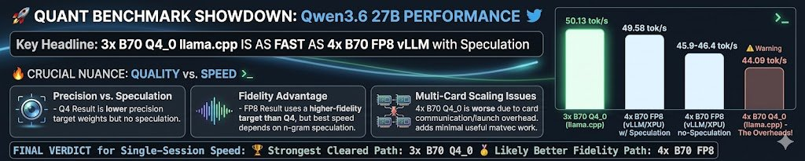
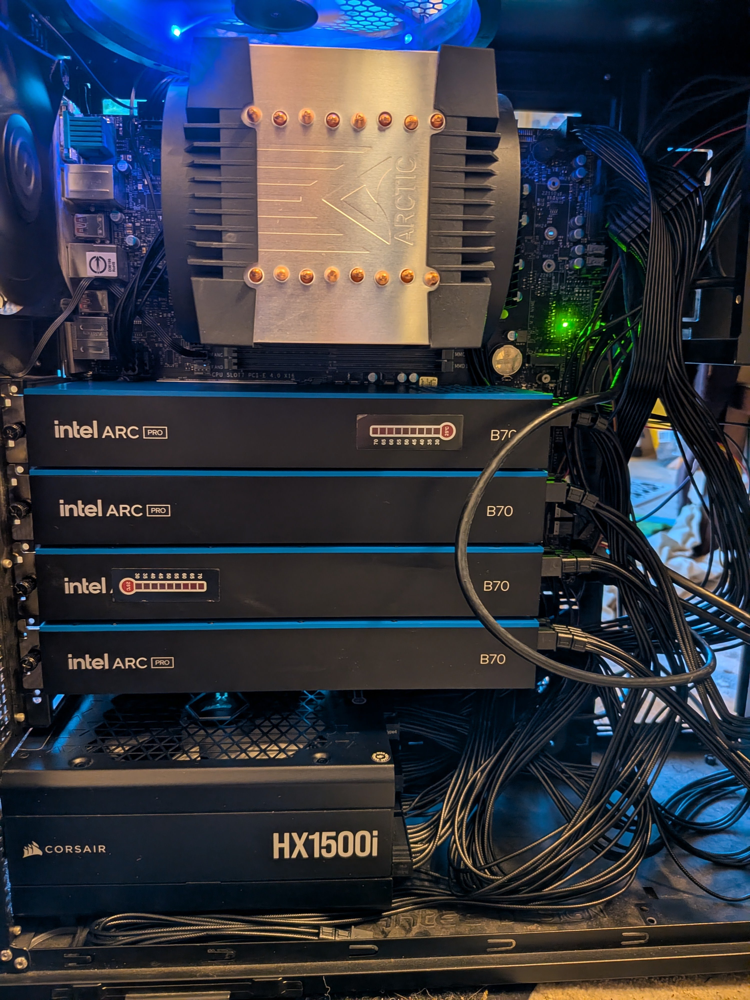

# Community Results And Build Notes

The point of this repository is not only to document one machine. It should help people reproduce, compare, and improve local AI deployments on B70s and other accessible GPUs.

## How You Can Contribute

Contributions do not need to be record-setting. The most valuable community
inputs are often the ones that make a result easier to reproduce or a failure
easier to fix:

- rerun a documented recipe on a different Intel driver/runtime stack;
- share exact `xpu-smi`, PyTorch XPU, oneAPI, oneCCL, vLLM, and kernel versions;
- publish negative results when a model does not fit, a graph mode fails, or a
  faster path changes output quality;
- add quality canaries for a model family before chasing speed;
- compare one-card, two-card, and four-card layouts honestly;
- open a small docs patch when a recipe step is unclear;
- point Intel/vLLM maintainers at compact repro artifacts rather than long chat
  transcripts.

Hardware access is also a contribution. The current four-B70 lab has made B70
visible in public benchmark tables and GitHub search results, but every active
optimization run consumes the same GPUs needed for service and comparison. More
high-VRAM Intel hardware in community hands would turn larger-model support from
occasional speculation into repeatable public recipes.

## What Slows The Work Down

The bottleneck is not a lack of possible ideas. The bottleneck is validating
them without lowering quality:

- model downloads and build trees are large;
- vLLM/XPU and SYCL builds can be slow and memory-hungry;
- some Intel compiler/runtime failures appear only at specific shapes;
- quality gates can invalidate fast results late;
- multi-GPU speed depends on PCIe, graph capture, collectives, and KV capacity;
- each serious model lane can occupy the available cards for days or weeks.

This is why higher-VRAM devices matter. A 32 GB B70 is an excellent community
baseline, but GLM 5.2, DeepSeek Flash-class models, and long-context MoE service
experiments need much more headroom before optimization can focus on kernels
and scheduling instead of survival.

## What To Share

A useful community result includes:

- Model name and exact quantization.
- Hardware, including number of cards and VRAM per card.
- Operating system and kernel.
- Driver/runtime stack.
- Engine: vLLM, llama.cpp, OpenVINO, custom harness, or something else.
- Exact command or linked recipe folder.
- Prompt length, output length, context length, batch size, and concurrency.
- Output-token throughput and total-token throughput.
- Quality gate or validation method.
- Whether speculative decoding was used.
- Whether power limits, clocks, or cooling changes were used.
- The negotiated PCIe generation and width for every selected card, whether
  links share a root/chipset uplink, and whether an external enclosure or riser
  was used. See the
  [PCIe topology and inference guide](pcie-topology-and-llm-inference.md).
- Raw logs or JSON artifacts where possible.

## Suggested Result Format

```text
Model:
Quantization:
Hardware:
OS/kernel:
Engine/backend:
Recipe or commit:
Prompt/output/context:
Batch/concurrency:
Quality check:
Output tok/s:
Total tok/s:
Notes:
Artifacts:
```

## Build Photos

Build photos are useful because multi-GPU local AI can fail for physical reasons:

- slot spacing
- risers
- airflow
- power cables
- board compatibility
- cooling pressure
- BIOS settings
- PSU margin
- acoustic expectations
- visible temperature indicators, if used

Photos should ideally show:

- the full system
- GPU spacing and airflow
- power cabling
- motherboard slot layout
- any risers or bifurcation cards
- storage layout if it matters for model/cache speed
- fan direction and blocked/unblocked intake paths
- labels for card order if software device order matters

Example public build-photo links from Steve's X feed:

- https://pbs.twimg.com/media/HHtRNbNW4AQNUNv?format=jpg&name=medium
- https://pbs.twimg.com/media/HI9wPxuW0AEsJoP?format=jpg&name=4096x4096

Prefer linking to public posts or images instead of committing large photos to the repo. If a photo is critical to a reproducible build, add a small compressed copy plus a short caption explaining what it proves.

### Example Build Photos



This wide photo is useful as a quick visual reference for the density and physical layout of a multi-B70 build. When publishing similar photos, add notes about motherboard, slot order, power cabling, and airflow direction.



This taller build photo is useful for discussing card spacing, blower intake clearance, case/workbench layout, and whether the system is being used as a lab rig or a finished workstation.

## Common Build Discussion Themes

These came up repeatedly in community discussion and should be captured in future build notes:

- Two B70s can be the practical option because they fit in more ordinary boards and cases.
- Four B70s are more fun for capacity and experiments, but demand more attention to board layout, airflow, power, and software scaling.
- Qwen-class FP8 models can be useful on two cards with more headroom than a single consumer GPU.
- MiniMax-class larger models push toward four cards or more specialized layouts.
- Blower cards can be reasonable in dense systems if intake is not starved.
- Decorative or diagnostic additions, such as heatsinks or temperature stickers, should be explained as cosmetic, practical, or both.
- Results should include whether the machine is quiet enough for office/home use or only acceptable in a lab/server room.

## Two Cards Versus Four Cards

Use two B70s when:

- the goal is a compact inference rig
- motherboard slots are limited
- power, cooling, or case size is constrained
- the model fits well with tensor parallel 2 or another two-device split
- you want a simpler path for Qwen-class FP8 or smaller local models

Use four B70s when:

- aggregate VRAM is the priority
- you are experimenting with larger models
- you want more concurrency headroom
- you can handle a workstation/server motherboard, case, PSU, cooling, and software complexity
- you are willing to benchmark scaling honestly instead of assuming more cards always helps

Four cards can be worse than two or three for some workloads if communication overhead dominates. Treat card count as an experimental variable.

## Social And Result Links

- Steve on X: https://x.com/xyster
- LocalMaxxing profile: https://localmaxxing.com/user/steveseguin
- Project timeline: https://steveseguin.github.io/llm-optimizations/optimization-timeline.html

The X feed is useful for chronology and informal discussion. The repo should remain the source for reproducible commands, patches, artifacts, and final notes.

## Records Need Labels

For community records, avoid a single naked "tok/s" number. At minimum, label:

- `output tok/s`: generated tokens only.
- `total tok/s`: prompt plus generated tokens.
- `accepted tok/s`: throughput after rejected attempts, retries, or invalid outputs are counted.
- `TTFT`: time to first token.
- `concurrency`: number of simultaneous requests.
- `quality`: exact hashes, semantic checks, human eval, benchmark score, or "not checked."
- `speculation`: whether draft/speculative decoding was enabled.
- `warm/cold`: whether the run happened after model load, graph capture, and
  compiler caches were already warm.
- `interconnect`: PCIe generation/width, Xe Link, NVLink, or other GPU-to-GPU
  fabric details.

This matters because a result can be excellent for prefill, decode, chat latency, or multi-user serving while looking mediocre under another metric.

Example from the current 4x B70 MiniMax host:

- Decode: about `83.8` warm output tok/s for p512/n1536.
- Prefill: about `1.7k-1.8k` prompt tok/s for prompt-heavy OpenAI API checks.
- Context: served at `32768` tokens; prompt 32,408 / output 64 completed.
- Interconnect clue: current PCIe4 x16 allreduce bandwidth measured
  `13.79 GB/s`, while an older faster reference measured `27.88 GB/s`.

Those numbers explain different parts of the user experience. Decode controls
how fast text streams after it starts. Prefill and TTFT control how long a long
prompt waits before the first generated token appears. Interconnect can cap
multi-GPU decode even when each card has enough VRAM.

## Metrics Beyond Tok/s

Useful community metrics include:

- batch-1 decode tok/s
- multi-user aggregate tok/s
- time to first token
- tokens per joule or wall power during a run
- maximum useful context length
- accepted output rate after retries or validation failures
- model quality versus a stock/reference path
- service stability over hours or days

For agentic use, concurrency and correctness can matter more than a single clean decode number.

## Recipe Versus Lab Note

Use `repro/` for recipes someone can run. Use `notes/` for lab history, failed attempts, and investigation details.

A result should become a `repro/` folder when:

- another person could follow it on a new machine
- it pins versions
- it includes scripts
- it includes validation
- it explains failure modes

Keep exploratory work in `notes/` until it is ready.

## Discussion Topics

Useful discussion threads include:

- "Feedback for Intel": install pain, drivers, oneAPI, PyTorch XPU, vLLM, compiler diagnostics, and missing wheels.
- "Model recipes": adding Qwen, MiniMax GGUF, smaller single-card recipes, and long-context recipes.
- "Build photos": board/slot/cooling layouts that work or fail.
- "Benchmark rules": standard shapes and quality gates for comparable community results.
- "Production serving": auth, firewalls, service supervision, monitoring, and rate limits.
