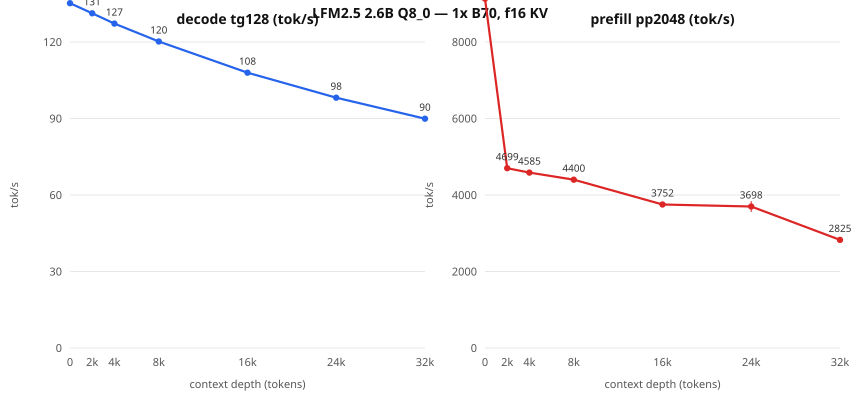

# LFM2.5 2.6B — neural.download packet (DRAFT: benchmarks pending)

> **Integrity status, 2026-08-27: strict headline pending.** The two varied
> 512-cap speeds and canary summary below are retained as measured candidate
> observations, but their raw operating-point/canary JSON files are not closed
> in this repository. Do not promote or submit them until those artifacts are
> imported, hash-bound, and the quality/determinism gate is replayed.

Status: **intake verified (direct+ordinary I/O) and baseline PASSED**
(2026-08-22). Lane: novice single-card.

**Intake diagnostic baseline (1x B70, 8K ctx, f16 KV, target-only,
128/100 window, cache-zero verified): `133.328 tok/s` median /
`132.988` p10.** Full packet operating points still pending.

## Identity

| Field | Value |
| --- | --- |
| Model | LFM2.5 2.6B, arch `lfm2` (hybrid conv/attention, 30 blocks, embed 2048, native ctx 131072) |
| File | `LFM2.5-2.6B-Q8_0.gguf` |
| SHA-256 | `1e22128dfa128bdfb684da167e74e072d0a056baa7d06d9f280291e2839b0fc9` |
| Source | `LiquidAI/LFM2.5-2.6B-GGUF` @ `f4a289c8a200a5ca71005ba7abc2dad33058a450` |
| Store | `/mnt/usb-models/llm-models/lfm2.5-2.6b-q8/` (catalog id `lfm25-26b-q8`) |
| Base | upstream llama.cpp `9fee29e9435f865ec0b811a783a6471a136d9317`, SYCL AOT bmg-g31, IntelLLVM 2026.0.0 |
| Device | 1x Intel Arc Pro B70 (32 GiB) |

Question this packet answers: smallest honest single-command B70 recipe.

## Recipe, benchmarks, quality — TBD (per the packet standard)

## Context-depth sweep (llama-bench raw engine rates, fa on, 5 reps)

| Depth | decode tg128 tok/s (±σ) | prefill pp2048 tok/s (±σ) |
|---:|---:|---:|
| 0 | 135.20 (±0.05) | 9130.9 (±11.4) |
| 2,048 | 131.26 (±0.05) | 4699.4 (±11.9) |
| 4,096 | 127.21 (±0.06) | 4584.9 (±13.1) |
| 8,192 | 120.20 (±0.03) | 4399.7 (±12.1) |
| 16,384 | 107.98 (±0.04) | 3752.4 (±10.9) |
| 24,576 | 98.14 (±0.11) | 3698.2 (±141.4) |
| 32,768 | 89.94 (±0.02) | 2824.9 (±4.8) |

Raw engine rates run above server-suite medians by design (no HTTP/sampling); use the suite median as the serving expectation and this curve for the depth trend. Evidence: `lfm25-26b-q8.sweep.json` + `lfm25-26b-q8.meta.json` (model/bench shas inside).

## Published operating point: standard (8K ctx, f16 KV, target-only)

Two fresh-server runs, 12-prompt suite, 512-token responses,
conventional 99-interval median computed from raw event offsets,
`cached_tokens=0` verified per request:

- run A: **`132.351606 tok/s`**
- run B: **`132.467576 tok/s`**

Evidence: `lfm25-26b-q8-std.benchA.json` / `lfm25-26b-q8-std.benchB.json` under
`bench-results/neural-download/operating-points-20260822/`.
Canary battery (reasoning off, temp 0, objective checks): 8x repeat hash-stability PASS, arithmetic PASS, exact copy PASS, JSON schema PASS — **pass_all=True** (`lfm25-26b-q8-std.canaries.json`).
Known behavior: emits untagged reasoning prose before the final answer regardless of the reasoning flag; answers are correct but verbose.
