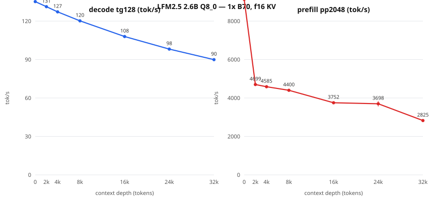

# LFM2.5 2.6B — neural.download one-B70 guide

> **Integrity status, 2026-08-27: strict headline qualified.** Two separately
> launched servers ran the complete 12-prompt/six-class, 512-cap suite with
> cache zero. Both workload and objective-canary gates passed, and complete
> token arrays matched 12/12 across servers. The paired class-balanced result
> is **132.137457 tok/s**.

Status: **intake verified (direct+ordinary I/O) and baseline PASSED**
(2026-08-22). Lane: novice single-card.

**Intake diagnostic baseline (1x B70, 8K ctx, f16 KV, target-only,
128/100 window, cache-zero verified): `133.328 tok/s` median /
`132.988` p10.** Full packet operating points still pending.

## Identity

| Field | Value |
| --- | --- |
| Model | LFM2.5 2.6B, arch `lfm2` (hybrid conv/attention, 30 blocks, embed 2048, native ctx 131072) |
| File | `LFM2.5-2.6B-Q8_0.gguf` |
| SHA-256 | `1e22128dfa128bdfb684da167e74e072d0a056baa7d06d9f280291e2839b0fc9` |
| Source | `LiquidAI/LFM2.5-2.6B-GGUF` @ `f4a289c8a200a5ca71005ba7abc2dad33058a450` |
| Store | `/mnt/usb-models/llm-models/lfm2.5-2.6b-q8/` (catalog id `lfm25-26b-q8`) |
| Base | upstream llama.cpp `9fee29e9435f865ec0b811a783a6471a136d9317`, SYCL AOT bmg-g31; the earlier depth sweep used IntelLLVM 2026.0.0. Complete strict-headline toolchain identity remains unresolved. |
| Device | 1x Intel Arc Pro B70 (32 GiB) |

Question this packet answers: smallest honest single-command B70 recipe.

## Reproduce the strict operating point

The measured result is qualified; the package remains a **candidate**, with
public build closure and clean-host replay pending. Source preparation below
is CPU-only and does not build, install a toolchain, download weights, or start
a server. It closes the missing source-acquisition step, not those later gates.

From this repository's root, choose an existing parent on a filesystem with
enough space and create a new source directory:

```bash
python3 repro/lfm25-26b-q8-b70/prepare-source.py --download \
  --output /path/to/existing-parent/llama-lfm25-source
```

The [source-input manifest](source-inputs.json) pins the public commit archive,
its size, SHA-256, member census and critical build inputs. The helper permits
one bounded download, authenticates it before extraction, rejects links and
unsafe paths, then reads back every extracted file and writes
`SOURCE-PREPARATION.json`. Preparation admits at most 512 MiB additional space
and retains 50 GiB free by default. A different destination's reserve requires
an explicit `--min-free-gib` value; no reserve is lowered automatically. This
is an initial space check, not a reservation or a build-space budget. An
already-downloaded exact archive can be supplied with `--archive /path/to/source.tar.gz`
instead of `--download`. Existing outputs are never overwritten; failed partial
outputs are retained for inspection. The archive has no Git metadata, so a
later CMake build can report an unknown Git version; the receipt binds the
source identity independently.

Before compilation, obtain the exact compiler/runtime, oneDPL, oneDNN,
oneMKL, TBB and Level Zero dependencies. The pinned upstream
[SYCL installation instructions](https://github.com/ggml-org/llama.cpp/blob/9fee29e9435f865ec0b811a783a6471a136d9317/docs/backend/SYCL.md#linux)
and [Intel toolkit source](https://www.intel.com/content/www/us/en/developer/tools/oneapi/base-toolkit.html)
describe provisioning, but do not establish the missing historical versions.
The [closure receipt](source-preparation-review.json) records the exact
remaining gates. Do not substitute a new toolchain and call its build the
measured runtime. The package manifest retains the historical CMake command;
building it needs its own storage admission and subsequent runtime/quality
validation. No build or fresh model result is claimed by source preparation.

After those prerequisites are independently validated, download the model
named in `model-manifest.json`, retain its exact filename, and verify it before
using the measured launch settings below.

```bash
export MODEL_DIR=/path/to/lfm2.5-2.6b-q8
export BUILD_DIR=/path/to/llama.cpp/build-sycl-aot-bmg-g31
python3 scripts/verify-neural-download-model.py \
  repro/lfm25-26b-q8-b70/model-manifest.json "$MODEL_DIR"

source /opt/intel/oneapi/setvars.sh --force
export ONEAPI_DEVICE_SELECTOR=level_zero:0
export GGML_SYCL_ENABLE_GRAPH=0

"$BUILD_DIR/bin/llama-server" \
  --model "$MODEL_DIR/LFM2.5-2.6B-Q8_0.gguf" --alias lfm25 \
  --reasoning off --ctx-size 8192 --cache-type-k f16 --cache-type-v f16 \
  --device SYCL0 --gpu-layers 99 --split-mode none --flash-attn auto \
  --parallel 1 --cache-ram 0 --ctx-checkpoints 0 --no-cache-prompt \
  --slot-prompt-similarity 0 --fit off --metrics --no-webui \
  --host 127.0.0.1 --port 18100
```

From a second shell, capture one attempt:

```bash
python3 scripts/bench-openai-realistic-suite.py \
  --base-url http://127.0.0.1:18100 --model lfm25 --api-mode native-raw \
  --suite repro/qwen36-27b-autoround-int4-b70/realistic-suite-v1.json \
  --max-tokens 512 --metric-tokens 100 --seed 42 --timeout 900 \
  --return-token-ids --require-natural-eos \
  --request-extra-json \
  '{"cache_prompt":false,"seed":42,"temperature":0,"top_p":1}' \
  --out performance.json

python3 scripts/neural-download-canaries.py \
  --base-url http://127.0.0.1:18100 --model lfm25 --out canaries.json
```

Inspect `realistic_final_gate`, `fresh_response_validity`, and `pass_all`; every
gate must pass and every request must report zero cached tokens. Historical
qualification required two separately supervised server runs and comparison
of every retained token array. This guide is not authorization for a restart
chain on a shared host. The historical lab automation is
`../../scripts/run-neural-download-stock-headline-attempt.sh`; it additionally
pins the archived runtime hashes and repository state. It requires explicit
`BUILD_DIR`, `MODEL_DIR`, `OUT_DIR`, `PROFILE_ID`, and `ATTEMPT` values and is
intentionally fail-closed. It also contains historical host-memory and
process-cleanup settings; preserve it as evidence, rather than executing it as
the current safe runner. Do not promote a replay from one attempt alone.

## Context-depth sweep (llama-bench raw engine rates, fa on, 5 reps)



| Depth | decode tg128 tok/s (±σ) | prefill pp2048 tok/s (±σ) |
|---:|---:|---:|
| 0 | 135.20 (±0.05) | 9130.9 (±11.4) |
| 2,048 | 131.26 (±0.05) | 4699.4 (±11.9) |
| 4,096 | 127.21 (±0.06) | 4584.9 (±13.1) |
| 8,192 | 120.20 (±0.03) | 4399.7 (±12.1) |
| 16,384 | 107.98 (±0.04) | 3752.4 (±10.9) |
| 24,576 | 98.14 (±0.11) | 3698.2 (±141.4) |
| 32,768 | 89.94 (±0.02) | 2824.9 (±4.8) |

Raw engine rates run above server-suite medians by design (no HTTP/sampling); use the suite median as the serving expectation and this curve for the depth trend. Evidence: `lfm25-26b-q8.sweep.json` + `lfm25-26b-q8.meta.json` (model/bench shas inside).

## Published operating point: standard (8K ctx, f16 KV, TP1, MTP0)

Two fresh-server runs, complete 12-prompt/six-class suite, 512-token cap,
class-balanced 99-interval medians computed from raw event offsets, and
`cached_tokens=0` verified per request:

- run A: **`132.161646 tok/s`**
- run B: **`132.113267 tok/s`**
- paired median: **`132.137457 tok/s`**

Both performance gates and both canary batteries passed. Complete token arrays
matched **12/12** across fresh servers. This establishes exact repeatability
and objective task correctness for this model/runtime identity; it is not a
claim that Q8_0 matches a separate higher-precision model token for token.

Evidence is fully repository-local:

- `../../data/2026-08-27-lfm25-q8-tp1-strict-headline-result.json`
- `../../data/2026-08-27-lfm25-q8-tp1-strict-headline-comparison.json`
- `../../data/neural-download-stock-headline-lfm25-20260827-r1a/`
- `../../data/neural-download-stock-headline-lfm25-20260827-r1b/`
- `../../data/2026-08-27-neural-download-stock-headline-closure-prereg.json`

The earlier `132.351606` / `132.467576 tok/s` observations are retained only
as historical notes: their raw operating-point and canary artifacts were not
stored in this repository, so they are not the headline. Known model behavior:
it can emit untagged reasoning prose before final answers even with reasoning
off; the objective answers in the qualified battery were correct.
