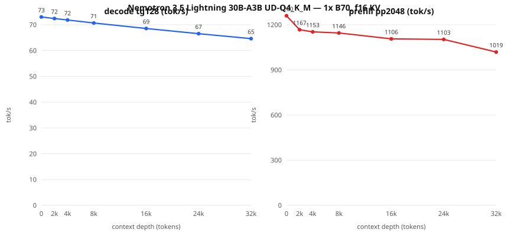

# Nemotron 3.5 Lightning 30B-A3B — neural.download packet (DRAFT: benchmarks pending)

> **Integrity status, 2026-08-27: strict headline pending.** The two varied
> 512-cap speeds and reasoning-off canary summary below are retained as measured
> candidate observations, but their raw operating-point/canary JSON files are
> not closed in this repository. Do not promote or submit them until those
> artifacts are imported, hash-bound, and the quality/determinism gate is
> replayed.

Status: **intake verified (direct+ordinary I/O) and baseline PASSED**
(2026-08-22) — the family runs on Intel B70 with no NVFP4 assumption.
Lane: mid MoE.

**Intake diagnostic baseline (1x B70, 8K ctx, f16 KV, target-only,
128/100 window, cache-zero verified): `72.873 tok/s` median /
`72.712` p10.** Full packet operating points still pending.

## Identity

| Field | Value |
| --- | --- |
| Model | NVIDIA Nemotron 3.5 Lightning 30B-A3B, arch `nemotron_h_moe` (hybrid Mamba-family, 53 blocks, 128 experts / 6 used, embed 2688, native ctx 1,048,576; official base `nvidia/NVIDIA-Nemotron-3.5-Lightning-30B-A3B-BF16`) |
| File | `NVIDIA-Nemotron-3.5-Lightning-30B-A3B-UD-Q4_K_M.gguf` |
| SHA-256 | `edcb5d4650796ed2fb412498de6f83b585862312c747ddb74f0ea04b22206181` |
| Source | `unsloth/NVIDIA-Nemotron-3.5-Lightning-30B-A3B-GGUF` @ `f2d3fe3694501008786e81e5f20360cbf715496a` |
| Store | `/mnt/usb-models/llm-models/nemotron-3.5-lightning-30b-a3b-udq4km/` (catalog id `nemotron-35-lightning-30b-a3b-udq4km`) |
| Base | upstream llama.cpp `9fee29e9435f865ec0b811a783a6471a136d9317`, SYCL AOT bmg-g31, IntelLLVM 2026.0.0 |
| Device | 1x Intel Arc Pro B70 (32 GiB); 2x comparison later |

Question this packet answers: does the family run on Intel B70 without
assuming NVIDIA's NVFP4 runtime works there.

## Recipe, benchmarks, quality — TBD (per the packet standard)

## Context-depth sweep (llama-bench raw engine rates, fa on, 5 reps)

| Depth | decode tg128 tok/s (±σ) | prefill pp2048 tok/s (±σ) |
|---:|---:|---:|
| 0 | 73.01 (±0.01) | 1260.0 (±5.7) |
| 2,048 | 72.42 (±0.01) | 1166.9 (±3.2) |
| 4,096 | 71.85 (±0.01) | 1153.1 (±2.0) |
| 8,192 | 70.70 (±0.01) | 1145.6 (±3.8) |
| 16,384 | 68.56 (±0.02) | 1106.1 (±4.6) |
| 24,576 | 66.55 (±0.02) | 1102.6 (±1.3) |
| 32,768 | 64.62 (±0.01) | 1018.9 (±2.1) |

Raw engine rates run above server-suite medians by design (no HTTP/sampling); use the suite median as the serving expectation and this curve for the depth trend. Evidence: `nemotron-35-lightning.sweep.json` + `nemotron-35-lightning.meta.json` (model/bench shas inside).

## Published operating point: standard (8K ctx, f16 KV, target-only)

Two fresh-server runs, 12-prompt suite, 512-token responses,
conventional 99-interval median computed from raw event offsets,
`cached_tokens=0` verified per request:

- run A: **`72.169452 tok/s`**
- run B: **`72.035976 tok/s`**

Evidence: `nemotron-35-lightning-std.benchA.json` / `nemotron-35-lightning-std.benchB.json` under
`bench-results/neural-download/operating-points-20260822/`.
Canary battery (reasoning off, temp 0, objective checks): 8x repeat hash-stability PASS, arithmetic PASS, exact copy PASS, JSON schema PASS — **pass_all=True** (`nemotron-35-lightning-std.canaries.json`).
Known behavior: with reasoning ON, 8x repeat outputs were not hash-stable (thinking-channel sampling); with reasoning off the model is deterministic. Recipe defaults to reasoning off for reproducibility-sensitive use.

## Two-card comparison (layer split, GPUs 0+1)

Same protocol, `--split-mode layer` across two B70s:
run A **`69.445407 tok/s`**, run B **`69.485984 tok/s`** (canaries 5/5).
That is ~3.7% BELOW the one-card point (72.17/72.04). **Recommendation:
one card** for single-stream serving. Evidence:
`nemotron-35-lightning-tp2.bench{A,B}.json`.
