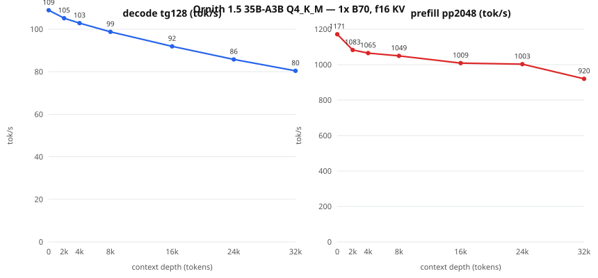

# Ornith 1.5 35B-A3B — neural.download packet (DRAFT: benchmarks pending)

Status: **intake verified (direct+ordinary I/O) and one-card baseline
PASSED** (2026-08-22). Lane: enthusiast MoE; two-card comparison now
unlocked by the valid one-card baseline.

**Intake diagnostic baseline (1x B70, 8K ctx, f16 KV, target-only,
128/100 window, cache-zero verified): `105.782 tok/s` median /
`105.284` p10.** Full packet operating points still pending.

## Identity

| Field | Value |
| --- | --- |
| Model | Ornith 1.5 35B-A3B, arch `qwen35moe` (256 experts / 8 used, 41 layers, GQA 16/2, embed 2048, native ctx 262144) |
| File | `Ornith-1.5-35B-Q4_K_M.gguf` (21,713,462,848 bytes) |
| SHA-256 | `ca6ea26329c88b78ffd90a85163be2e746c2fafd1024f56db47e499f117f9a7f` |
| Source | `ornith-ai/Ornith-1.5-35B-A3B-GGUF` @ `fbbaed45c2f0e200276ffa51701a24d45dc7f57e` |
| Store | `/mnt/usb-models/llm-models/ornith-1.5-35b-a3b-q4km/` (catalog id `ornith-15-35b-a3b-q4km`) |
| Base | upstream llama.cpp `9fee29e9435f865ec0b811a783a6471a136d9317`, SYCL AOT bmg-g31, IntelLLVM 2026.0.0 |
| Device | 1x Intel Arc Pro B70 (32 GiB); 2x comparison later |

Question this packet answers: validate the new family and an outside
one-B70 performance claim independently. The external report is a lead,
not evidence; only matched local runs are published.

## Recipe, benchmarks, quality — TBD (per the packet standard)

## Context-depth sweep (llama-bench raw engine rates, fa on, 5 reps)

| Depth | decode tg128 tok/s (±σ) | prefill pp2048 tok/s (±σ) |
|---:|---:|---:|
| 0 | 108.91 (±0.06) | 1171.2 (±9.1) |
| 2,048 | 105.15 (±0.25) | 1082.7 (±4.1) |
| 4,096 | 102.85 (±0.19) | 1065.1 (±5.3) |
| 8,192 | 98.76 (±0.16) | 1049.3 (±6.9) |
| 16,384 | 91.92 (±0.03) | 1008.5 (±4.6) |
| 24,576 | 85.79 (±0.03) | 1002.6 (±8.3) |
| 32,768 | 80.42 (±0.16) | 920.1 (±7.4) |

Raw engine rates run above server-suite medians by design (no HTTP/sampling); use the suite median as the serving expectation and this curve for the depth trend. Evidence: `ornith-15-35b-a3b-q4km.sweep.json` + `ornith-15-35b-a3b-q4km.meta.json` (model/bench shas inside).

## Published operating point: standard (8K ctx, f16 KV, target-only)

Two fresh-server runs, 12-prompt suite, 512-token responses,
conventional 99-interval median computed from raw event offsets,
`cached_tokens=0` verified per request:

- run A: **`104.839983 tok/s`**
- run B: **`104.810772 tok/s`**

Evidence: `ornith-15-35b-a3b-std.benchA.json` / `ornith-15-35b-a3b-std.benchB.json` under
`bench-results/neural-download/operating-points-20260822/`.
Canary battery (reasoning off, temp 0, objective checks): 8x repeat hash-stability PASS, arithmetic PASS, exact copy PASS, JSON schema PASS — **pass_all=True** (`ornith-15-35b-a3b-std.canaries.json`).
