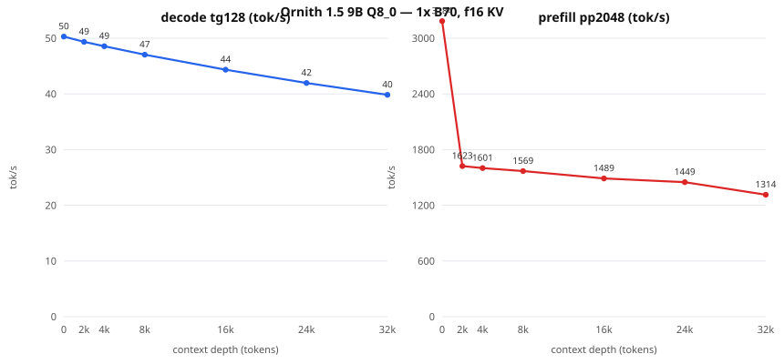

# Ornith 1.5 9B — neural.download one-B70 guide

> **Integrity status, 2026-08-27: strict headline withheld.** Two complete
> fresh-server 12-prompt/six-class, 512-cap attempts passed the workload,
> cache-zero, and objective-canary gates at 49.593582 and 49.515869 tok/s.
> Complete natural-response token arrays matched only 8/12 across servers, so
> these rates remain scoped diagnostics rather than a public headline.

Status: **intake verified (direct+ordinary I/O) and baseline PASSED**
(2026-08-22). Lane: beginner-plus single-card.

**Intake diagnostic baseline (1x B70, 8K ctx, f16 KV, target-only,
128/100 window, cache-zero verified): `50.109 tok/s` median /
`50.061` p10.** Full packet operating points still pending.

## Identity

| Field | Value |
| --- | --- |
| Model | Ornith 1.5 9B (dense), arch `qwen35`, 32 layers, embed 4096, native ctx 262144 |
| File | `Ornith-1.5-9B-Q8_0.gguf` |
| SHA-256 | `6874eeb25c71081dc8f0bbe88f3ebb786312447132745371cd980bce95d259b9` |
| Source | `ornith-ai/Ornith-1.5-9B-GGUF` @ `85bf2b98cdcbad4291cb4f46943526cc089f75a0` |
| Store | `/mnt/usb-models/llm-models/ornith-1.5-9b-q8/` (catalog id `ornith-15-9b-q8`) |
| Base | upstream llama.cpp `9fee29e9435f865ec0b811a783a6471a136d9317`, SYCL AOT bmg-g31, IntelLLVM 2026.0.0 |
| Device | 1x Intel Arc Pro B70 (32 GiB) |

Question this packet answers: recent official one-card model as a beginner
package candidate.

## Storage requirement

Keep the GGUF on a local NVMe/SATA SSD or a sufficiently fast direct-attached
USB SSD while serving. Do not benchmark this packet from a slow network mmap.
On the independent audit host, the exact Q8_0 file decoded at
`50.149 tok/s` from internal NVMe but only `25.642 tok/s` from the current
100 Mb/s NFS mount under the same graph-off command; the remote samples also
ramped as pages arrived. That is an I/O placement failure, not a model or
kernel baseline. Verify the copied file against the SHA-256 above before use.
Raw matched evidence is in
`../../experiments/ornith-15-b70/notes/2026-08-22-decode-first-screen.md`.

## Reproduce the measured identity

Clone this repository, build the pinned stock llama.cpp revision in the package
manifest, and download the model named in `model-manifest.json`. Keep it on
local or fast direct-attached storage; do not benchmark a network-backed mmap.

```bash
export MODEL_DIR=/path/to/ornith-1.5-9b-q8
export BUILD_DIR=/path/to/llama.cpp/build-sycl-aot-bmg-g31
python3 scripts/verify-neural-download-model.py \
  repro/ornith-15-9b-q8-b70/model-manifest.json "$MODEL_DIR"

source /opt/intel/oneapi/setvars.sh --force
export ONEAPI_DEVICE_SELECTOR=level_zero:0
export GGML_SYCL_ENABLE_GRAPH=0

"$BUILD_DIR/bin/llama-server" \
  --model "$MODEL_DIR/Ornith-1.5-9B-Q8_0.gguf" --alias ornith9b \
  --reasoning off --ctx-size 8192 --cache-type-k f16 --cache-type-v f16 \
  --device SYCL0 --gpu-layers 99 --split-mode none --flash-attn auto \
  --parallel 1 --cache-ram 0 --ctx-checkpoints 0 --no-cache-prompt \
  --slot-prompt-similarity 0 --fit off --metrics --no-webui \
  --host 127.0.0.1 --port 18100
```

From a second shell:

```bash
python3 scripts/bench-openai-realistic-suite.py \
  --base-url http://127.0.0.1:18100 --model ornith9b --api-mode native-raw \
  --suite repro/qwen36-27b-autoround-int4-b70/realistic-suite-v1.json \
  --max-tokens 512 --metric-tokens 100 --seed 42 --timeout 900 \
  --return-token-ids --require-natural-eos \
  --request-extra-json \
  '{"cache_prompt":false,"seed":42,"temperature":0,"top_p":1}' \
  --out performance.json

python3 scripts/neural-download-canaries.py \
  --base-url http://127.0.0.1:18100 --model ornith9b --out canaries.json
```

Run a second fresh server and compare every complete array with
`scripts/compare-strict-attempt-outputs.py`. The lab's stricter archived-binary
runner is `scripts/run-neural-download-stock-headline-attempt.sh`; it requires
explicit `BUILD_DIR`, `MODEL_DIR`, `OUT_DIR`, `PROFILE_ID`, and `ATTEMPT` and
fails closed. A future result is publishable only if both full gates pass and
all 12 arrays match, not merely because its speed resembles the diagnostics.

## Context-depth sweep (llama-bench raw engine rates, fa on, 5 reps)



| Depth | decode tg128 tok/s (±σ) | prefill pp2048 tok/s (±σ) |
|---:|---:|---:|
| 0 | 50.29 (±0.00) | 3184.5 (±10.0) |
| 2,048 | 49.34 (±0.01) | 1623.0 (±3.2) |
| 4,096 | 48.55 (±0.01) | 1601.2 (±2.4) |
| 8,192 | 47.04 (±0.01) | 1568.6 (±2.1) |
| 16,384 | 44.35 (±0.01) | 1489.2 (±2.8) |
| 24,576 | 41.96 (±0.00) | 1448.8 (±20.3) |
| 32,768 | 39.84 (±0.01) | 1313.7 (±3.4) |

Raw engine rates run above server-suite medians by design (no HTTP/sampling); use the suite median as the serving expectation and this curve for the depth trend. Evidence: `ornith-15-9b-q8.sweep.json` + `ornith-15-9b-q8.meta.json` (model/bench shas inside).

## Strict operating-point replay: failed output gate

Two fresh-server runs, complete 12-prompt/six-class suite, 512-token cap,
class-balanced 99-interval medians, target-only TP1/MTP0, and cache zero:

- run A: **`49.593582 tok/s`**
- run B: **`49.515869 tok/s`**

Both performance/cache gates and both objective-canary batteries passed, but
complete arrays matched **8/12**. `code-review`, `customer-email`,
`incident-retrospective`, and `sql-debugging` first diverged at generated token
26, 169, 123, and 256 respectively. There is therefore no paired headline.

Repository-local evidence:

- `../../data/2026-08-27-ornith15-9b-q8-tp1-strict-headline-comparison.json`
- `../../data/neural-download-stock-headline-ornith9-20260827-r1a/`
- `../../data/neural-download-stock-headline-ornith9-20260827-r1b/`
- `../../data/2026-08-27-neural-download-stock-headline-closure-prereg.json`

The older `49.588381` / `49.573292 tok/s` observations remain historical only;
their raw artifacts were not retained and the current strict replay does not
retroactively qualify them.
