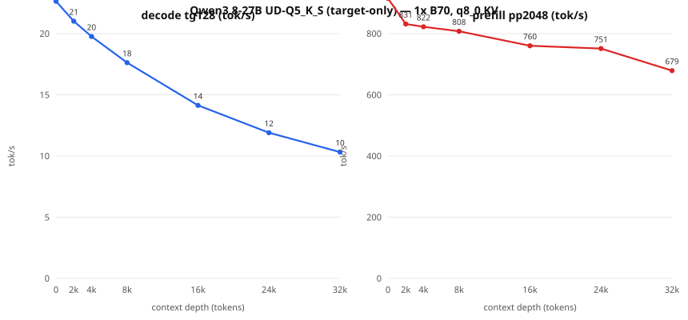

# Qwen3.8-27B 256K flagship package — neural.download packet (DRAFT: fit-off pending)

Status: **FIT-OFF DECIDED — UD-Q5_K_S ships as the flagship quant**
(2026-08-22). It loaded and completed the diagnostic suite on one B70 at
`--ctx-size 262144` with q8_0 K/V, the vision mmproj, and the MTP draft
all resident, with **2.86 GiB VRAM still free**. Package suite rate
(**MTP-assisted**, 128/100 window, cache-zero): `27.004 tok/s` median /
`24.084` p10 (spread is content-dependent draft acceptance). UD-Q4_K_XL
becomes the documented headroom alternative. Since completed:
- **Vision smoke PASS** at the full 256K config: deterministic 173-byte
  test image (red field, blue corner), answers "Red" / "Blue" exactly
  (`qwen38-vision-smoke.json`).
- **Target-only companion**: tg128 22.64 tok/s at depth 0 (raw engine,
  q8_0 KV; see the depth sweep) vs 26.67 MTP-assisted suite median.
- **UD-Q4_K_XL alternative point** at the identical package config:
  `27.510236` / `27.493910 tok/s` (two fresh servers, canaries 5/5) —
  about +3% over the shipped Q5_K_S, for users preferring speed and
  headroom over the highest-fitting quant.

## Identity (all from `unsloth/Qwen3.8-27B-GGUF` @ `4ca720788d1e01f1bff70c033e0d0028fd02e502`)

| Component | File | Bytes | SHA-256 |
| --- | --- | ---: | --- |
| Weights candidate A | `Qwen3.8-27B-UD-Q4_K_XL.gguf` | 17,559,178,144 | `3f227079003add2511437e5b1e94812e363385225bf6a9b47b0054a72bc8b01e` |
| Weights candidate B | `Qwen3.8-27B-UD-Q5_K_S.gguf` | 18,665,753,504 | `d8d62ffcf84d42658dd6ccf9782b4d0404700af78b26d750507510c7597b5bfe` |
| Vision tower | `mmproj-F16.gguf` | 927,607,488 | `cbb841a9ee0636b2ec172f5bb8df2ea8dfeb01e90fe7c6126581d662a0b4e43e` |
| MTP draft | `MTP/mtp-Qwen3.8-27B-Q4_0.gguf` | 1,369,590,656 | `50d9ce5a6da381bbcfb31061cf73df94a90e6faf8efeddee379a9cb8f1501c6e` |

Store: `/mnt/usb-models/llm-models/qwen3.8-27b-unsloth-gguf/`. Base:
upstream llama.cpp `9fee29e9435f...`, SYCL AOT bmg-g31. Device: 1x B70.

## The fit-off (preregistered decision rule)

Architecture: 64 layers, 16 full-attention (4 KV heads x head_dim 256),
so KV at 262144 costs 16.0 GiB at f16 or 8.5 GiB at q8_0. Paper budget
(31.5 GiB card): weights + KV(q8_0) + mmproj 0.87 + draft 1.28 (+draft
KV) + compute buffers + slack. Q4_K_XL fits with ~1.4 GiB margin;
Q5_K_S has ~0.2 GiB paper margin — inside the error bar of the
compute-buffer estimate.

Rule: load each candidate with the full package (262144 ctx, q8_0 K/V,
mmproj, MTP draft) on one B70. The **highest quant that loads and
completes the diagnostic suite at 262144 without OOM ships as the
package quant**; the other is recorded as an alternative operating
point at whatever context it supports. f16-KV variants are published
only as reduced-context operating points, never as the 256K headline.

## Recipe, benchmarks, quality — TBD (per the packet standard)

## Context-depth sweep (llama-bench raw engine rates, fa on, 5 reps)

| Depth | decode tg128 tok/s (±σ) | prefill pp2048 tok/s (±σ) |
|---:|---:|---:|
| 0 | 22.64 (±0.05) | 915.1 (±1.5) |
| 2,048 | 21.01 (±0.01) | 831.4 (±1.0) |
| 4,096 | 19.76 (±0.01) | 822.3 (±1.1) |
| 8,192 | 17.63 (±0.01) | 807.6 (±0.7) |
| 16,384 | 14.14 (±0.01) | 760.4 (±1.3) |
| 24,576 | 11.90 (±0.00) | 751.0 (±1.1) |
| 32,768 | 10.32 (±0.00) | 678.9 (±0.5) |

Raw engine rates run above server-suite medians by design (no HTTP/sampling); use the suite median as the serving expectation and this curve for the depth trend. Evidence: `qwen38-27b-q5ks-flagship.sweep.json` + `qwen38-27b-q5ks-flagship.meta.json` (model/bench shas inside).

## Published operating point: shipped package (262144 ctx, q8_0 KV, vision + MTP draft resident; MTP-assisted)

Two fresh-server runs, 12-prompt suite, up to 512-token responses
(actual prompts 48--78 tokens; one natural-EOS row per run ended early),
conventional 99-interval median computed from raw event offsets,
`cached_tokens=0` verified per request:

- run A: **`26.668277 tok/s`**
- run B: **`26.640510 tok/s`**

Evidence: `qwen38-256k-package.benchA.json` / `qwen38-256k-package.benchB.json` under
`bench-results/neural-download/operating-points-20260822/`.
Canary battery (reasoning off, temp 0, objective checks): 8x repeat hash-stability PASS, arithmetic PASS, exact copy PASS, JSON schema PASS — **pass_all=True** (`qwen38-256k-package.canaries.json`).
